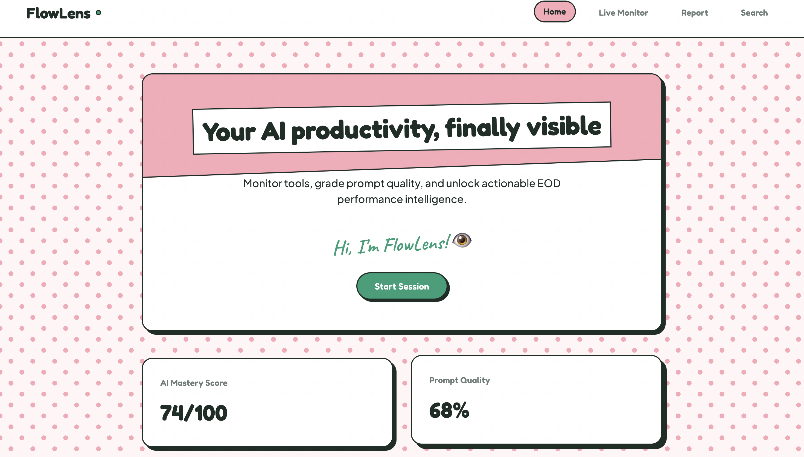
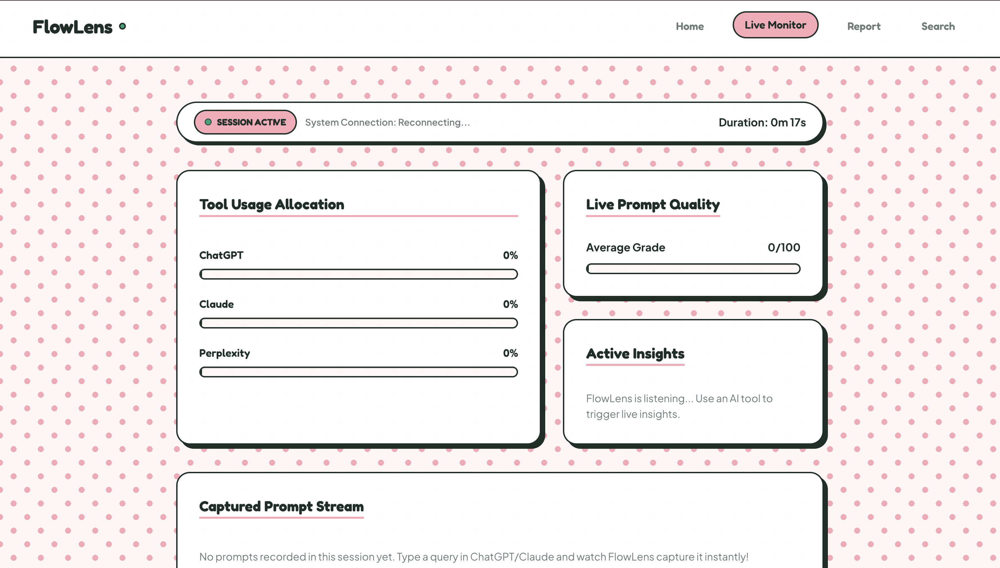
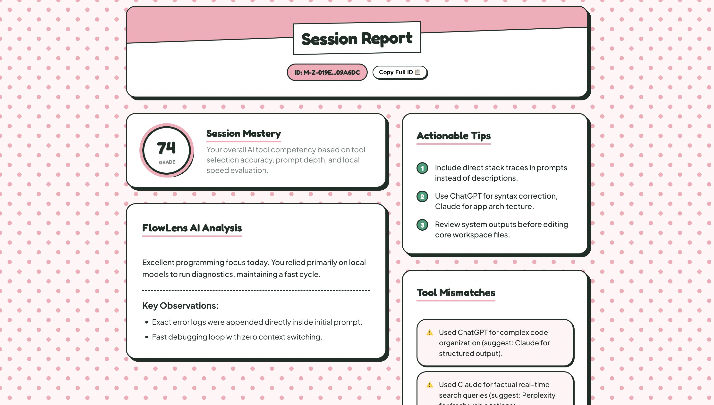
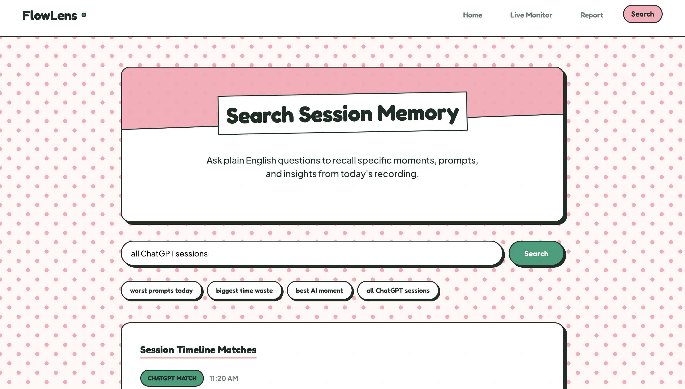
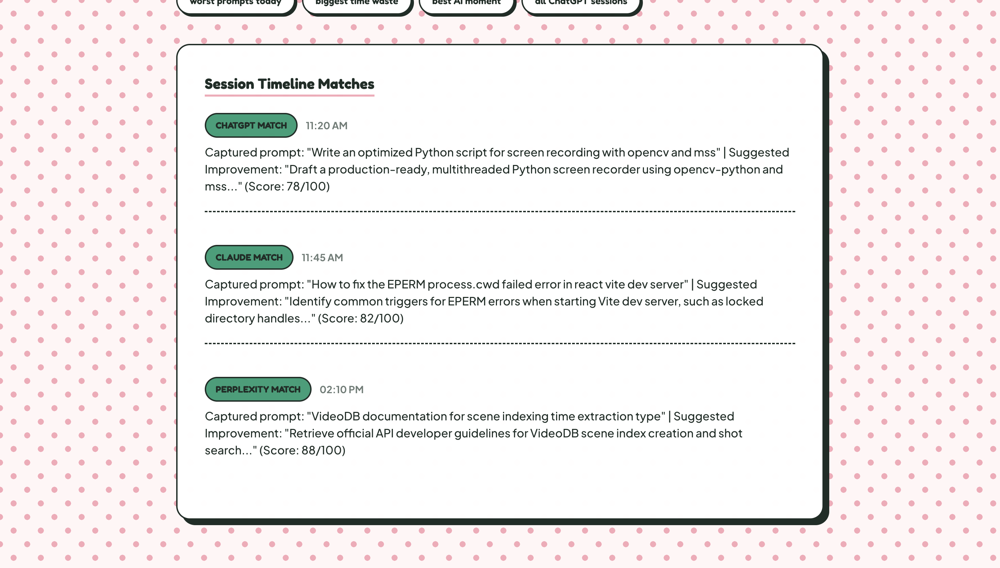
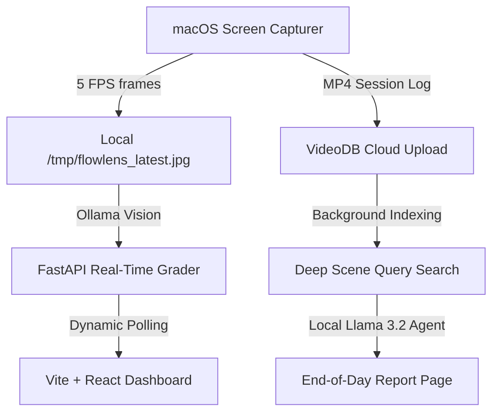

# FlowLens — Your Local AI Productivity Coach

<div align="center">
  
  <h3>"Your AI productivity, finally visible."</h3>
  <p>A 100% local macOS screen analyst and AI prompt tutor that converts passive work sessions into actionable performance metrics, prompt improvements, and time breakdown intelligence.</p>
</div>

## Interactive Showcase Gallery

### Cozy Neo-Brutalist Dashboard Landing Page


### Dynamic Screen Permission Request Notification


### Real-Time Screen & AI Prompt Monitor


### Local AI Session Intelligence Report



---

## Key Features

* **100% Local Screen Analysis**: Watches your active workspace frames in real-time. No cloud uploads, no leak risks — fully secure on your machine.
* **Real-Time Ollama Vision Integration**: Utilizes local `llama3.2-vision` to grade your active AI prompts (0-100), identify the exact tools you use (ChatGPT, Claude, Perplexity), and generate optimized prompt suggestions on the fly.
* **Cozy Honeyglow Dashboard**: A stunning neo-brutalist theme inside a responsive Vite React dashboard showing real-time tool usage percentages, average grading metrics, and live-updating prompt streams.
* **Background Scene Indexing**: Automatically saves your recorded capture as an MP4 log, uploads it, and indexes scenes in the background so your sessions are instantly searchable in plain English via VideoDB.
* **End-of-Day Performance Reports**: Synthesizes session recordings into a crisp, unified intelligence report displaying your overall AI Mastery Grade, concise recommendations, and helpful tool mismatch warnings (e.g. ChatGPT vs. Claude vs. Perplexity).

---

## Architecture & Technology Stack



* **Frontend**: React (v18), Vite, Vanilla CSS Theme, React Router.
* **Backend**: FastAPI, Python 3.13, OpenCV (`cv2`), `mss` Screen Recorder, `asyncio` task threads.
* **Local AI**: Ollama (`llama3.2`, `llama3.2-vision`).
* **AI Orchestration**: Agno (formerly Phidata) Agent Framework.
* **Indexing Database**: VideoDB (Scene-based temporal AI searching).

---

## Step-by-Step Installation & Setup

### 1. Prerequisites (macOS)
Make sure you have `ffmpeg` and local AI binaries installed on your Mac:
```bash
brew install ffmpeg
```

### 2. Configure Local AI (Ollama)
Download the local text and vision models. Vision is required to read screenshots, text is required to run the EOD Agent:
```bash
# 1. Download Ollama App from https://ollama.com
# 2. Open your terminal and pull the models:
ollama pull llama3.2
ollama pull llama3.2-vision
```

### 3. Backend Setup
1. Navigate to the backend directory:
   ```bash
   cd backend
   ```
2. Install Python dependencies:
   ```bash
   pip install -r requirements.txt
   ```
3. Configure your environment variables inside `backend/.env`:
   ```env
   VIDEODB_API_KEY=your_videodb_api_key_here
   ```
4. Start the FastAPI server:
   ```bash
   uvicorn main:app --reload --port 8000
   ```

### 4. Frontend Setup
1. Navigate to the frontend directory:
   ```bash
   cd frontend
   ```
2. Install Node dependencies:
   ```bash
   npm install
   ```
3. Start the local Vite developer server:
   ```bash
   npm run dev
   ```
4. Open **[http://localhost:5173/](http://localhost:5173/)** in your browser!

---

## How to Run a Real Test Session

1. **Start Screen Watcher**: Tap **Start Session** on the home page. Allow the screen recording permission.
2. **Interact with AI**: Open ChatGPT, Claude, or Perplexity in your browser and write a quick prompt (e.g. *"Write a simple Python function to sort a list"*).
3. **Watch Real-Time Capture**: Open the **Live Monitor** tab. Within 10 seconds, the tool statistics will update showing ChatGPT/Claude at `100%` and your exact typed prompt will appear in the stream with a local AI score!
4. **End & Grade**: Click **Stop & Analyze Session**. You will be instantly redirected to your short, crisp **Session Report** page showing your dynamic Mastery Score!

---

<div align="center">
  <p>Created by FlowLens Team. Empowering developers to master AI engineering.</p>
</div>
